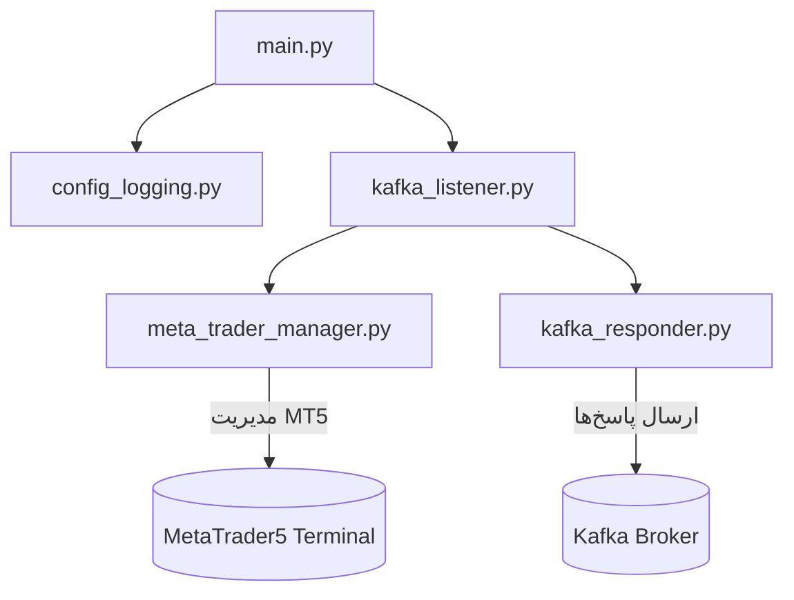
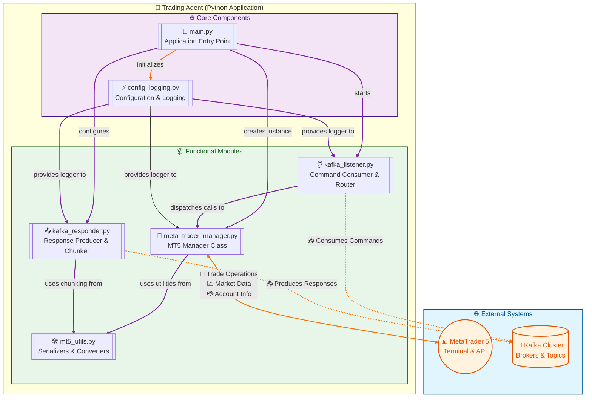
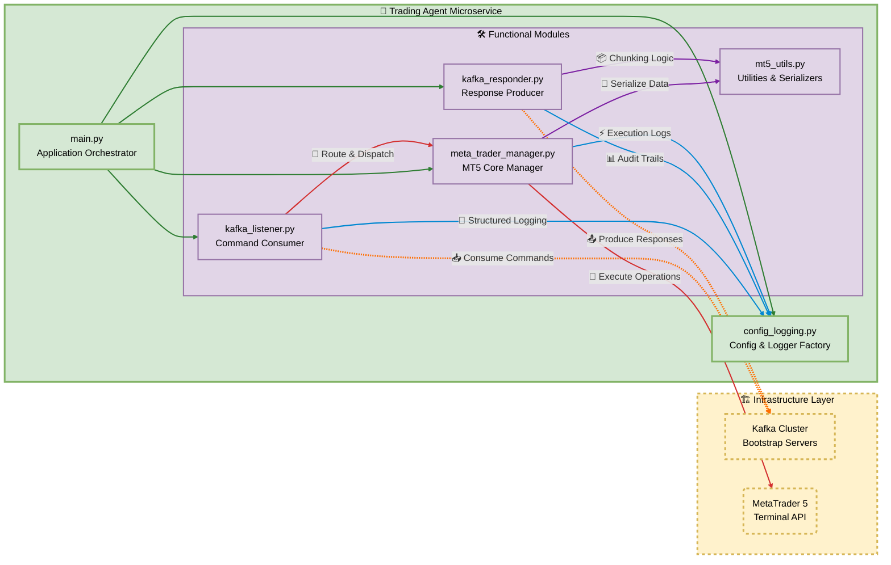
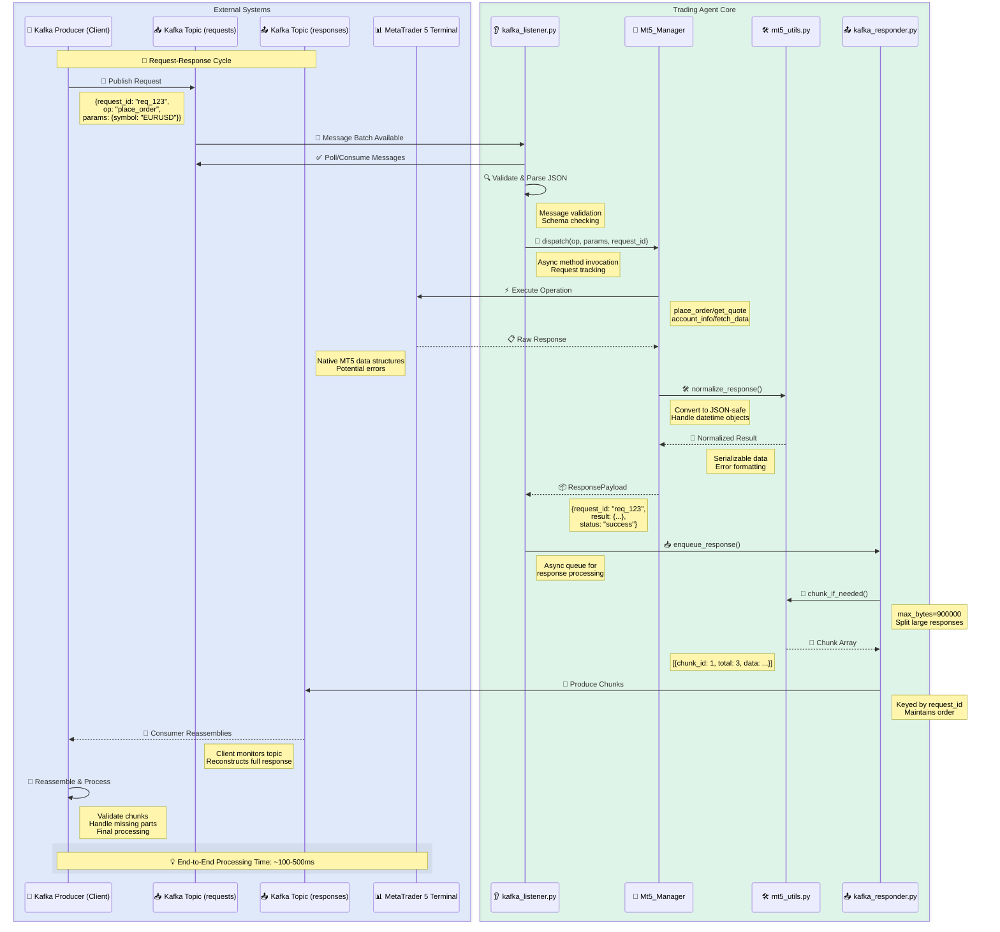
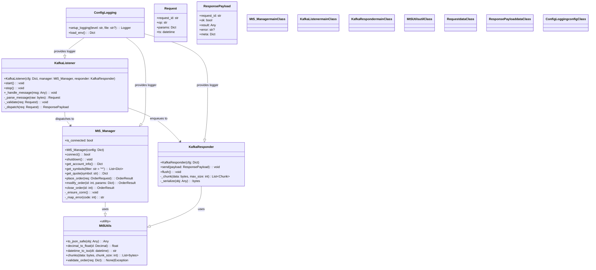
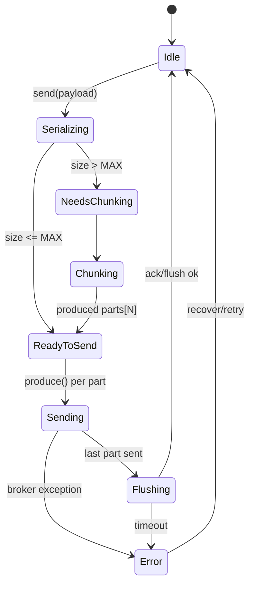
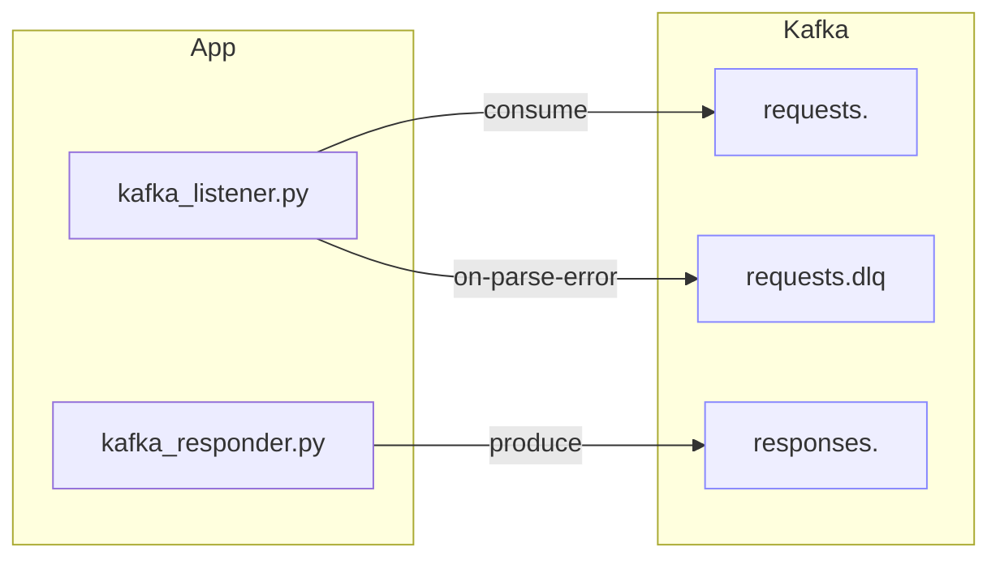
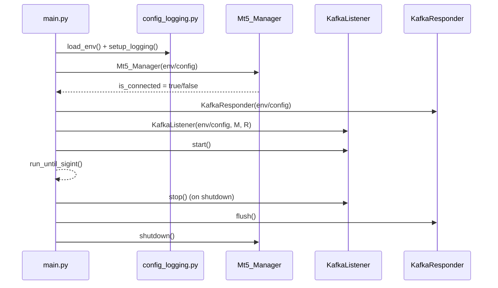
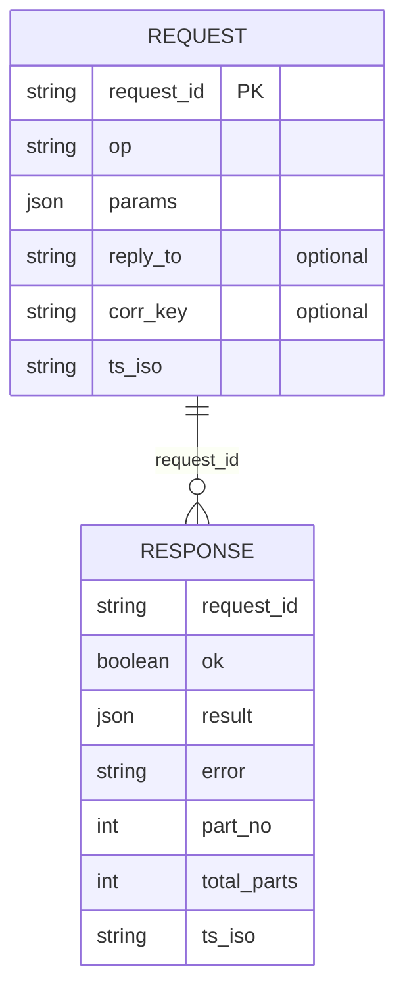
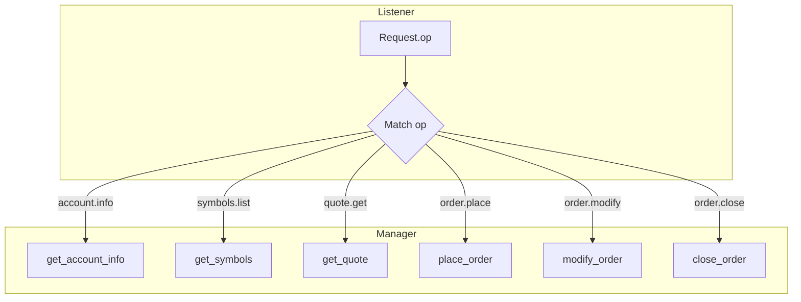

---

# README.md

```markdown
<!--
📌 این فایل README.md برای ریپوی شماست
📌 شامل معرفی کامل، ساختار پروژه، نحوه اجرا، پیام‌های Kafka، معماری، نکات و عیب‌یابی
📌 تمام بخش‌ها با کامنت‌های فارسی توضیح داده شده تا تیم شما راحت‌تر نگهداری کند
-->
```

# 🎯 سیستم مدیریت MetaTrader5 با Kafka
<!-- معرفی پروژه -->
این پروژه یک معماری ماژولار برای اتصال به **MetaTrader5 (MT5)** و مدیریت داده‌ها/معاملات از طریق **پیام‌های Kafka** ارائه می‌دهد.  
تمامی بخش‌ها به زبان پایتون پیاده‌سازی شده و برای **مقیاس‌پذیری، مانیتورینگ، و نگهداری در محیط تولید** بهینه‌سازی شده‌اند.  

---

## 📂 ساختار پروژه
<!-- ساختار پوشه‌ها و فایل‌ها -->

---

```text
project/
├─ config.json                    # ← فایل تنظیمات مرکزیِ پروژه (جایگزین تمام ENVها)
│                                 #    - قابلیت «هات‌ریلُد»: بدون ری‌استارت، تغییرات اعمال می‌شود.
│                                 #    - همهٔ ماژول‌ها (کافکا/لاگ/MT5/اجر) از این فایل می‌خوانند.
│                                 #    - پشتیبانی از {client_id} در رشته‌ها (مثال: cmd.{client_id}.p0).
│
├─ config_manager.py              # ← ماژول مدیریت تنظیمات با هات‌ریلُد
│                                 #    - خواندن config.json (با پشتیبانی از کامنت‌ها: //, /* */, #).
│                                 #    - ادغام با مقادیر پیش‌فرض (DEFAULTS) اگر کلیدی در فایل نبود.
│                                 #    - متدهای کاربردی:
│                                 #         cfg().get("kafka.bootstrap_servers") → دسترسی نقطه‌ای
│                                 #         cfg().get_all() → دریافت اسنپ‌شات کامل کانفیگ
│                                 #    - نخِ ناظر (watcher) برای تشخیص تغییراتِ فایل و ریلود خودکار.
│
├─ config_logging.py              # ← راه‌اندازی لاگ‌گذاری بر اساس تنظیمات در config.json
│                                 #    - تنظیم سطح لاگ، JSON یا Human، و فایل‌لاگ با Rotation.
│                                 #    - فقط از cfg() می‌خواند؛ وابستگی به ENV حذف شده.
│                                 #    - خروجی یکنواخت برای همهٔ ماژول‌ها (کنسول + فایل logs/app.log).
│
├─ mt5_utils.py                   # ← توابع ابزار MT5
│                                 #    - parse_iso_dt: تبدیل امن رشته‌های ISO به datetime با timezone=UTC.
│                                 #    - to_mt5_const: نگاشت نام کانستنتِ رشته‌ای → کانستنت‌های mt5.*
│                                 #    - convert_params: تمیزکاری/تبدیل پارامترهای دریافتی قبل از فراخوانی متدها.
│                                 #    - safe_serialize: سریال‌سازی امن اشیاء (datetime/np/pd/… → JSON-safe).
│
├─ meta_trader_manager.py         # ← کلاس Mt5_Manager (هستهٔ تعامل با MetaTrader 5)
│                                 #    - متدهای مدیریت اتصال: initialize/login/version/account_info/…
│                                 #    - نمادها: total/get/info/tick/select
│                                 #    - مارکت‌بوک: add/get/release
│                                 #    - دادهٔ تاریخی: rates/ticks با روش‌های from / range / …
│                                 #    - معاملات: total/get/calc_margin/calc_profit/check/send
│                                 #    - پوزیشن‌ها/تاریخچه: positions_* و history_* (orders/deals)
│                                 #    - کاملاً ایمن‌سازی شده با لاگ و تبدیل خروجی‌ها به dict/DataFrame.
│
├─ priority_executor.py           # ← صف اولویت‌دار داخل کلاینت + Aging + قفل حوزه‌ای
│                                 #    - submit(): افزودن تسک با priority و ordering_scope و TTL.
│                                 #    - aging loop: ارتقای تدریجی تسک‌های منتظر (مثلاً هر ۵ ثانیه یک پله).
│                                 #    - ورکرهای موازی: بخشی رزرو برای Low (۶..۱۰) تا گرسنگی رخ ندهد.
│                                 #    - پارامترها از "executor.*" در config.json قابل تنظیم است:
│                                 #         max_workers / reserved_low_slots / aging_step_seconds / …
│
├─ client_auth.py                 # ← مدیریت ثبت‌نام کلاینت + توکن + heartbeat + ساخت هدر امن
│                                 #    - ارسال درخواست ثبت‌نام به topics.register و انتظار پاسخ از register_responses.
│                                 #    - نگهداشت client_id / auth_token / expires_at و ارسال دوره‌ای status.
│                                 #    - ساخت هدرهای خروجی استاندارد (ts/nonce/auth/kid/sig/…)
│                                 #    - همهٔ پارامترها از "client_auth.*" در config.json خوانده می‌شود.
│
├─ kafka_listener.py              # ← مصرف‌کنندهٔ دستورات (Kafka Consumer) و فراخوانی متدهای Mt5_Manager
│                                 #    - خواندن تاپیک‌های ورودی از "kafka.topics.commands" (پشتیبانی p0/p1/p2).
│                                 #    - parse امن بدنهٔ پیام (JSON یا literal_eval کنترل‌شده).
│                                 #    - تبدیل params با mt5_utils.convert_params و فراخوانی متد مناسب.
│                                 #    - ارسال پاسخ استاندارد با KafkaResponder (Envelope: schema/corr_id/…).
│                                 #    - تنظیمات کافکا/گروه/سکیوریتی از "kafka.*" در config.json.
│
├─ kafka_responder.py             # ← تولیدکنندهٔ پاسخ (Kafka Producer) با چانکینگ
│                                 #    - send_result(): تبدیل نتیجه به JSON → چانک کردن → ارسال با هدرهای استاندارد.
│                                 #    - هدرها: corr_id / schema / seq / total / content_type / encoding.
│                                 #    - پارامترهای producer از config.json (compression/linger/retries/…).
│                                 #    - تاپیک خروجی از "kafka.topics.replies".
│
├─ main.py                        # ← نقطهٔ شروع برنامه
│                                 #    - بارگذاری کانفیگ با cfg()
│                                 #    - راه‌اندازی لاگ‌گذاری (setup_logging(cfg))
│                                 #    - ساخت و اجرای KafkaListener(cfg)
│                                 #    - خاموشی ایمن با سیگنال‌ها (Ctrl+C / SIGTERM)
│
├─ Examples/                      # ← نمونه‌کدها و ابزارهای تست/دمو
│  ├─ sender.py                   #    - نمونهٔ ارسال پیام (Producer) برای تست فرمان‌ها/متدها
│  └─ consumer_example.py         #    - نمونهٔ دریافت پاسخ‌ها (Consumer) و مونتاژ چانک‌ها (seq/total)
│
├─ README.md                      # ← راهنمای پروژه: پیش‌نیازها، اجرا، مثال‌ها، نکات دیباگ
│                                 #    - توضیح استفاده از config.json، نحوه ارسال فرمان، ساخت پیام MT5 و …
│
├─ logs/                          # ← پوشهٔ پیش‌فرض لاگ‌ها (Rotation) – ایجاد خودکار در زمان اجرا
│  └─ app.log                     #    - فایل لاگِ اصلی (اگر logging.file_enabled=true باشد)
│
├─ .gitignore                     # ← نادیده‌گرفتن فایل‌ها/پوشه‌های حساس یا تولیدی (logs/، __pycache__/، …)
│
└─ requirements.txt               # ← وابستگی‌های پایتون (confluent-kafka / MetaTrader5 / pandas / pytz و …)
                                  #    - نصب با:  pip install -r requirements.txt

# نکات اجرایی سریع:
# 1) ابتدا config.json را با مقادیر مناسب پر کنید (bootstrap_servers، client_id، مسیر MT5 و …).
# 2) اجرای برنامه:
#       python -m project.main
#    یا اگر در ریشه هستید:
#       python project/main.py
# 3) برای تست مسیر Kafka:
#    - در Examples/sender.py یک پیام با key="Mt5_Manager" و body={"method": "...", "params": {...}} بفرستید.
#    - در Examples/consumer_example.py پاسخ‌ها را بخوانید و چانک‌ها را بر اساس seq/total مونتاژ کنید.
# 4) هر زمان config.json را ویرایش کنید، تغییرات در چند ثانیه بعد (app.hot_reload_check_sec) اعمال می‌شود.
#    نیازی به ری‌استارتِ برنامه نیست.

```

---

## ⚙️ پیش‌نیازها

<!-- وابستگی‌های اصلی -->

* Python 3.9+
* کتابخانه‌های:

  * `MetaTrader5`
  * `confluent-kafka`
  * `pandas`
  * `pytz`

```bash
pip install MetaTrader5 confluent-kafka pandas pytz
```

---

## 🔧 پیکربندی (ENV Variables)

<!-- لیست کامل متغیرهای محیطی با مقادیر پیش‌فرض -->

| نام                             | پیش‌فرض                | توضیح                      |
| ------------------------------- | ---------------------- | -------------------------- |
| `KAFKA_SERVERS`                 | `192.168.1.254:9092`   | آدرس سرور Kafka            |
| `KAFKA_TOPIC`                   | `agent-send`           | تاپیک مصرف                 |
| `KAFKA_RESPONSE_TOPIC`          | `agent-recive`         | تاپیک پاسخ                 |
| `KAFKA_GROUP_ID`                | `kafka_listener_group` | گروه Consumer              |
| `KAFKA_COMPRESSION`             | `zstd`                 | نوع فشرده‌سازی Producer    |
| `KAFKA_RESPONSE_MAX_PART_BYTES` | `921600`               | حداکثر سایز هر پارت پاسخ   |
| `LOG_LEVEL`                     | `INFO`                 | سطح لاگ                    |
| `LOG_JSON`                      | `false`                | فعال‌سازی خروجی JSON       |
| `LOG_FILE`                      | `logs/app.log`         | مسیر فایل لاگ              |
| `LOG_MAX_BYTES`                 | `10485760`             | حجم هر فایل لاگ (۱۰MB)     |
| `LOG_BACKUPS`                   | `10`                   | تعداد فایل‌های پشتیبان     |
| `MT5_PATH`                      | —                      | مسیر ترمینال MT5 (اختیاری) |
| `MT5_LOGIN`                     | —                      | لاگین حساب (اختیاری)       |
| `MT5_PASSWORD`                  | —                      | رمز حساب (اختیاری)         |
| `MT5_SERVER`                    | —                      | سرور بروکر (اختیاری)       |

---

## 🚀 اجرای برنامه

<!-- نحوه اجرا -->

اجرای ساده:

```bash
python main.py
```

اجرای با ENV سفارشی:

```bash
LOG_LEVEL=DEBUG LOG_JSON=true LOG_FILE=logs/app.log \
KAFKA_SERVERS="10.0.0.12:9092" \
python main.py
```

---

## 📨 نمونه پیام Kafka

<!-- مثال پیام ورودی با key و value -->

هر پیام شامل:

* **key**: باید `"Mt5_Manager"` باشد
* **value**: آرایه JSON از دستورات

### مثال: اتصال + دریافت تیک + ارسال سفارش

```json
[
  { "method": "manage_connection", "params": { "action": "initialize" } },
  { "method": "manage_symbols", "params": { "action": "tick", "symbol": "EURUSD" } },
  { "method": "trade_manager", "params": {
      "action": "check",
      "request": {
        "action": "TRADE_ACTION_DEAL",
        "type": "ORDER_TYPE_BUY",
        "symbol": "EURUSD",
        "volume": 0.10,
        "magic": 987654
      }
  }},
  { "method": "trade_manager", "params": {
      "action": "send",
      "request": {
        "action": "TRADE_ACTION_DEAL",
        "type": "ORDER_TYPE_BUY",
        "symbol": "EURUSD",
        "volume": 0.10,
        "magic": 987654
      }
  }}
]
```

---

## 📊 معماری سیستم

<!-- دیاگرام مرمید (سازگار با گیت‌هاب) -->



---

## ✅ Best Practices

<!-- نکات مهم برای استفاده در تولید -->

* همیشه **Magic Number** را در سفارش‌ها ست کن.
* در سفارش‌های مارکت، قیمت را خالی بگذار → سیستم به طور خودکار bid/ask را پر می‌کند.
* در محیط Production، **JSON Logging** را فعال کن.
* پیام‌های چند مرحله‌ای را با ترتیب صحیح بفرست (initialize → check → send).
* برای داده‌های حجیم تاریخچه، از **فیلتر group/ticket/position\_id** استفاده کن.

---

## 🐞 عیب‌یابی سریع

<!-- مشکلات رایج و راه‌حل سریع -->

| مشکل                            | علت                             | راه‌حل                                                     |
| ------------------------------- | ------------------------------- | ---------------------------------------------------------- |
| `MT5 not initialized/connected` | قبل از initialize فراخوانی کردی | اول `manage_connection/initialize` رو بزن                  |
| کانستنت نگاشت نمی‌شود           | رشته اشتباه است                 | مطمئن شو کانستنت دقیق است (مثل `ORDER_TYPE_BUY`)           |
| `order_send retcode != DONE`    | خطای بروکر یا پارامترها         | اول `check` بزن، بعد `send`؛ deviation/filling را تنظیم کن |
| داده تاریخی خالی                | بازه یا نماد نامعتبر            | تاریخ باید ISO/UTC باشد؛ نماد باید فعال باشد               |

---

## 🤝 مشارکت

<!-- راهنمای مشارکت در پروژه -->

۱. ریپو را fork کن.
۲. یک branch جدید بساز:

```bash
git checkout -b feature/my-change
```

۳. تغییراتت را commit کن و Pull Request بزن.

---

## 📜 مجوز

<!-- مجوز پروژه -->

این پروژه تحت لایسنس MIT ارائه می‌شود.

```
این نسخه:  
- ✅ تمیز برای نمایش در گیت‌هاب (کامنت‌ها در خروجی HTML نهایی نمایش داده نمی‌شوند).  
- ✅ خط به خط توضیح داده شده تا تیم شما راحت‌تر بخواند.  
- ✅ کامل‌تر از نسخه قبلی (جزئیات بیشتری در عیب‌یابی و Best Practices).  

می‌خوای برای هر ماژول (`Guide.md`‌ها) هم همین سبک **کامنت مخفی Markdown** رو اعمال کنم که تیم وقتی فایل‌ها رو توی GitHub می‌خونه، یادداشت‌های داخلی شما هم قابل دیدن باشه؟
```


---

# معماری کلان (High-level)



---

# مؤلفه‌ها و وابستگی‌ها (Component Map)



---

# سکانس جریان درخواست/پاسخ (End-to-End Sequence)



---

# دیاگرام کلاس‌ها (Class Diagram)



---

***
# وضعیت و چرخهٔ chunking در پاسخ‌گو (State Machine)
***



---

# کانال‌ها و کانفیگ کافکا (Topic/Config Map)



---

# خط لولهٔ راه‌اندازی برنامه (Startup Pipeline)



---

# قرارداد پیام‌ها (Schemas – پیشنهادی/متعارف)

> اگر اسکیمای دقیق‌تون فرق داره، همین بلوک رو با کلیدهای واقعی‌تون جایگزین کن.



---

# ماتریس عملیات (Op Routing)



---

