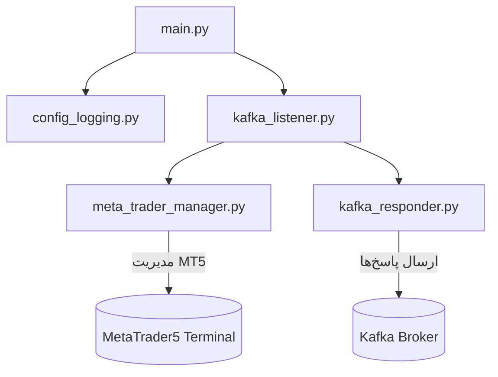
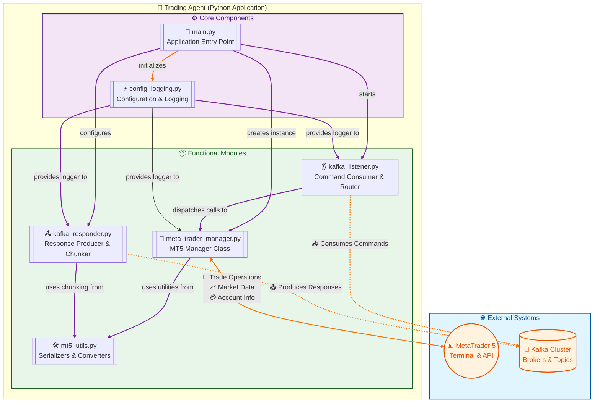
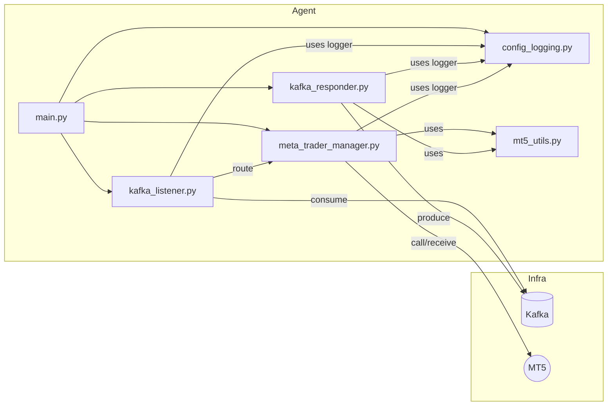
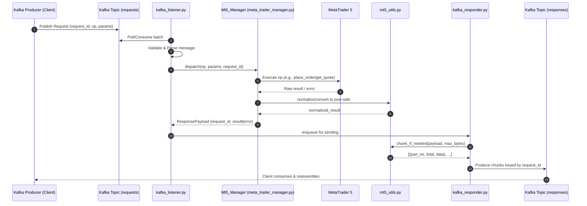
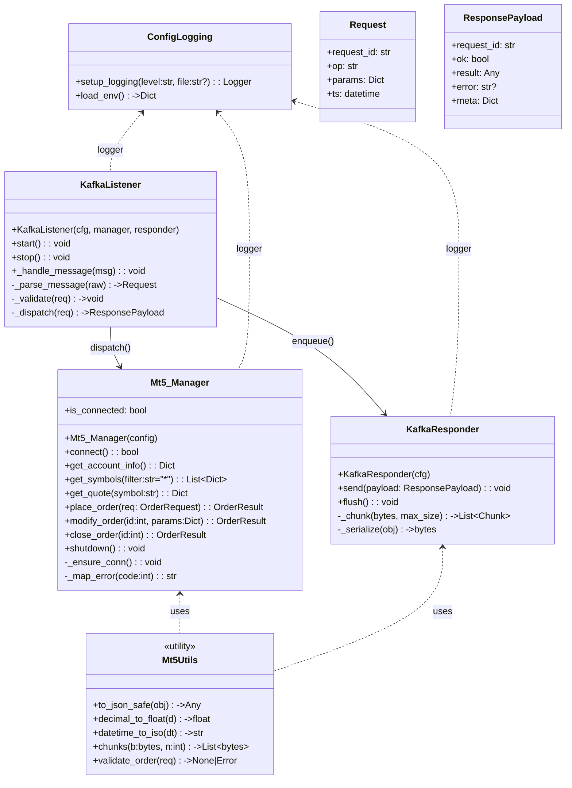
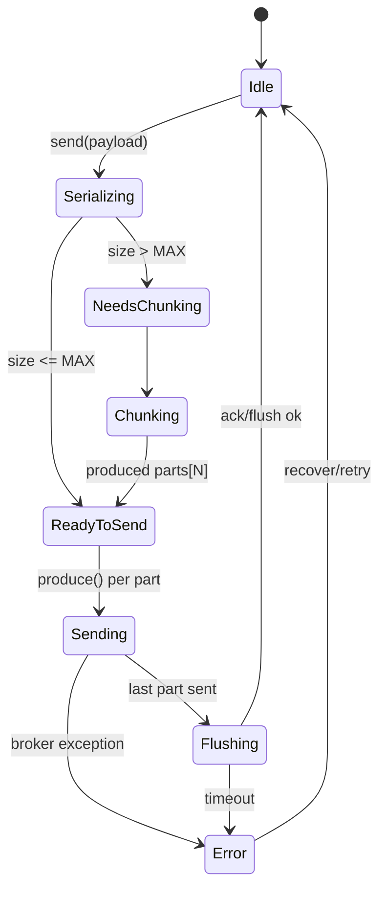
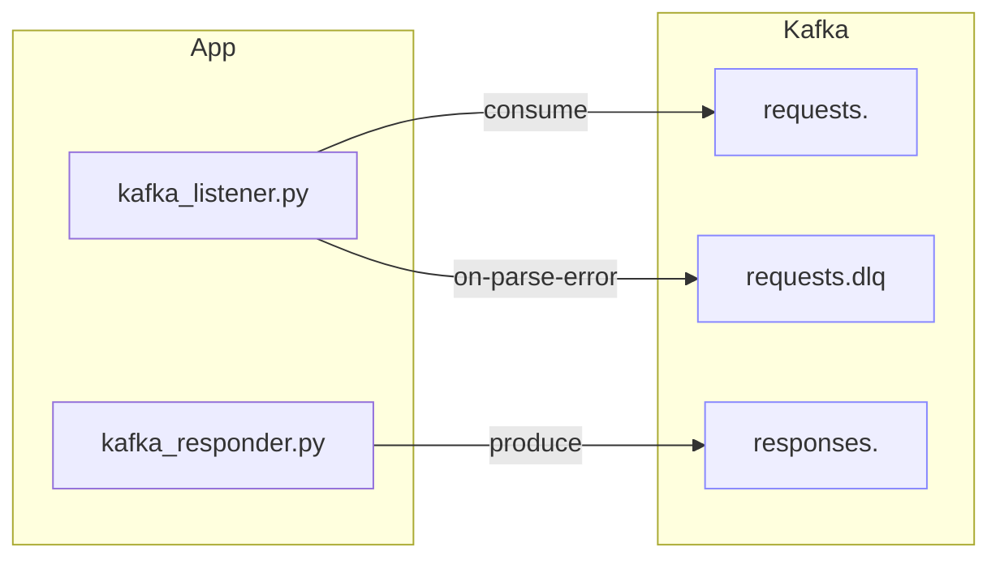
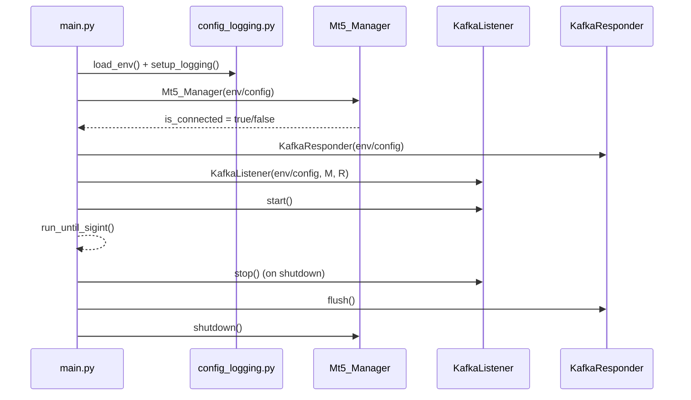
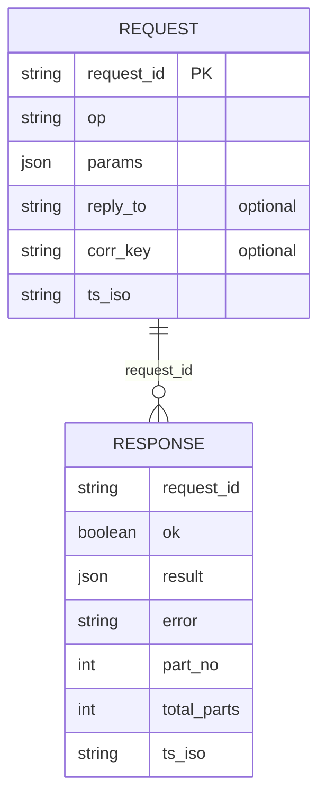
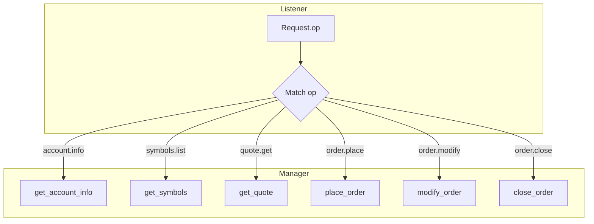

---

# README.md

```markdown
<!--
📌 این فایل README.md برای ریپوی شماست
📌 شامل معرفی کامل، ساختار پروژه، نحوه اجرا، پیام‌های Kafka، معماری، نکات و عیب‌یابی
📌 تمام بخش‌ها با کامنت‌های فارسی توضیح داده شده تا تیم شما راحت‌تر نگهداری کند
-->
```

# 🎯 سیستم مدیریت MetaTrader5 با Kafka
<!-- معرفی پروژه -->
این پروژه یک معماری ماژولار برای اتصال به **MetaTrader5 (MT5)** و مدیریت داده‌ها/معاملات از طریق **پیام‌های Kafka** ارائه می‌دهد.  
تمامی بخش‌ها به زبان پایتون پیاده‌سازی شده و برای **مقیاس‌پذیری، مانیتورینگ، و نگهداری در محیط تولید** بهینه‌سازی شده‌اند.  

---

## 📂 ساختار پروژه
<!-- ساختار پوشه‌ها و فایل‌ها -->

---

```text
project/
├─ config_logging.py          # مرحله ۱: تنظیمات و لاگ‌گذاری
├─ mt5_utils.py               # مرحله ۲: نگاشت کانستنت‌ها، تاریخ‌ها، سریال‌سازی امن
├─ kafka_responder.py         # مرحله ۳: تولیدکنندهٔ پاسخ (Producer) + چانکینگ
├─ kafka_listener.py          # مرحله ۴: مصرف‌کنندهٔ دستورات (Consumer) + فراخوانی متدها
├─ meta_trader_manager.py     # همون نسخهٔ بهینه‌ی قبلی شما
├─ main.py                    # مرحله ۵: نقطهٔ شروع برنامه
└─ Examples/                  # پوشهٔ نمونه‌ها
   ├─ sender.py
   └─ consumer_example.py
```

---

## ⚙️ پیش‌نیازها

<!-- وابستگی‌های اصلی -->

* Python 3.9+
* کتابخانه‌های:

  * `MetaTrader5`
  * `confluent-kafka`
  * `pandas`
  * `pytz`

```bash
pip install MetaTrader5 confluent-kafka pandas pytz
```

---

## 🔧 پیکربندی (ENV Variables)

<!-- لیست کامل متغیرهای محیطی با مقادیر پیش‌فرض -->

| نام                             | پیش‌فرض                | توضیح                      |
| ------------------------------- | ---------------------- | -------------------------- |
| `KAFKA_SERVERS`                 | `192.168.1.254:9092`   | آدرس سرور Kafka            |
| `KAFKA_TOPIC`                   | `agent-send`           | تاپیک مصرف                 |
| `KAFKA_RESPONSE_TOPIC`          | `agent-recive`         | تاپیک پاسخ                 |
| `KAFKA_GROUP_ID`                | `kafka_listener_group` | گروه Consumer              |
| `KAFKA_COMPRESSION`             | `zstd`                 | نوع فشرده‌سازی Producer    |
| `KAFKA_RESPONSE_MAX_PART_BYTES` | `921600`               | حداکثر سایز هر پارت پاسخ   |
| `LOG_LEVEL`                     | `INFO`                 | سطح لاگ                    |
| `LOG_JSON`                      | `false`                | فعال‌سازی خروجی JSON       |
| `LOG_FILE`                      | `logs/app.log`         | مسیر فایل لاگ              |
| `LOG_MAX_BYTES`                 | `10485760`             | حجم هر فایل لاگ (۱۰MB)     |
| `LOG_BACKUPS`                   | `10`                   | تعداد فایل‌های پشتیبان     |
| `MT5_PATH`                      | —                      | مسیر ترمینال MT5 (اختیاری) |
| `MT5_LOGIN`                     | —                      | لاگین حساب (اختیاری)       |
| `MT5_PASSWORD`                  | —                      | رمز حساب (اختیاری)         |
| `MT5_SERVER`                    | —                      | سرور بروکر (اختیاری)       |

---

## 🚀 اجرای برنامه

<!-- نحوه اجرا -->

اجرای ساده:

```bash
python main.py
```

اجرای با ENV سفارشی:

```bash
LOG_LEVEL=DEBUG LOG_JSON=true LOG_FILE=logs/app.log \
KAFKA_SERVERS="10.0.0.12:9092" \
python main.py
```

---

## 📨 نمونه پیام Kafka

<!-- مثال پیام ورودی با key و value -->

هر پیام شامل:

* **key**: باید `"Mt5_Manager"` باشد
* **value**: آرایه JSON از دستورات

### مثال: اتصال + دریافت تیک + ارسال سفارش

```json
[
  { "method": "manage_connection", "params": { "action": "initialize" } },
  { "method": "manage_symbols", "params": { "action": "tick", "symbol": "EURUSD" } },
  { "method": "trade_manager", "params": {
      "action": "check",
      "request": {
        "action": "TRADE_ACTION_DEAL",
        "type": "ORDER_TYPE_BUY",
        "symbol": "EURUSD",
        "volume": 0.10,
        "magic": 987654
      }
  }},
  { "method": "trade_manager", "params": {
      "action": "send",
      "request": {
        "action": "TRADE_ACTION_DEAL",
        "type": "ORDER_TYPE_BUY",
        "symbol": "EURUSD",
        "volume": 0.10,
        "magic": 987654
      }
  }}
]
```

---

## 📊 معماری سیستم

<!-- دیاگرام مرمید (سازگار با گیت‌هاب) -->



---

## ✅ Best Practices

<!-- نکات مهم برای استفاده در تولید -->

* همیشه **Magic Number** را در سفارش‌ها ست کن.
* در سفارش‌های مارکت، قیمت را خالی بگذار → سیستم به طور خودکار bid/ask را پر می‌کند.
* در محیط Production، **JSON Logging** را فعال کن.
* پیام‌های چند مرحله‌ای را با ترتیب صحیح بفرست (initialize → check → send).
* برای داده‌های حجیم تاریخچه، از **فیلتر group/ticket/position\_id** استفاده کن.

---

## 🐞 عیب‌یابی سریع

<!-- مشکلات رایج و راه‌حل سریع -->

| مشکل                            | علت                             | راه‌حل                                                     |
| ------------------------------- | ------------------------------- | ---------------------------------------------------------- |
| `MT5 not initialized/connected` | قبل از initialize فراخوانی کردی | اول `manage_connection/initialize` رو بزن                  |
| کانستنت نگاشت نمی‌شود           | رشته اشتباه است                 | مطمئن شو کانستنت دقیق است (مثل `ORDER_TYPE_BUY`)           |
| `order_send retcode != DONE`    | خطای بروکر یا پارامترها         | اول `check` بزن، بعد `send`؛ deviation/filling را تنظیم کن |
| داده تاریخی خالی                | بازه یا نماد نامعتبر            | تاریخ باید ISO/UTC باشد؛ نماد باید فعال باشد               |

---

## 🤝 مشارکت

<!-- راهنمای مشارکت در پروژه -->

۱. ریپو را fork کن.
۲. یک branch جدید بساز:

```bash
git checkout -b feature/my-change
```

۳. تغییراتت را commit کن و Pull Request بزن.

---

## 📜 مجوز

<!-- مجوز پروژه -->

این پروژه تحت لایسنس MIT ارائه می‌شود.

```
این نسخه:  
- ✅ تمیز برای نمایش در گیت‌هاب (کامنت‌ها در خروجی HTML نهایی نمایش داده نمی‌شوند).  
- ✅ خط به خط توضیح داده شده تا تیم شما راحت‌تر بخواند.  
- ✅ کامل‌تر از نسخه قبلی (جزئیات بیشتری در عیب‌یابی و Best Practices).  

می‌خوای برای هر ماژول (`Guide.md`‌ها) هم همین سبک **کامنت مخفی Markdown** رو اعمال کنم که تیم وقتی فایل‌ها رو توی GitHub می‌خونه، یادداشت‌های داخلی شما هم قابل دیدن باشه؟
```


---

# معماری کلان (High-level)



---

# مؤلفه‌ها و وابستگی‌ها (Component Map)



---

# سکانس جریان درخواست/پاسخ (End-to-End Sequence)



---

# دیاگرام کلاس‌ها (Class Diagram)



---

# وضعیت و چرخهٔ chunking در پاسخ‌گو (State Machine)



---

# کانال‌ها و کانفیگ کافکا (Topic/Config Map)



---

# خط لولهٔ راه‌اندازی برنامه (Startup Pipeline)



---

# قرارداد پیام‌ها (Schemas – پیشنهادی/متعارف)

> اگر اسکیمای دقیق‌تون فرق داره، همین بلوک رو با کلیدهای واقعی‌تون جایگزین کن.



---

# ماتریس عملیات (Op Routing)



---

